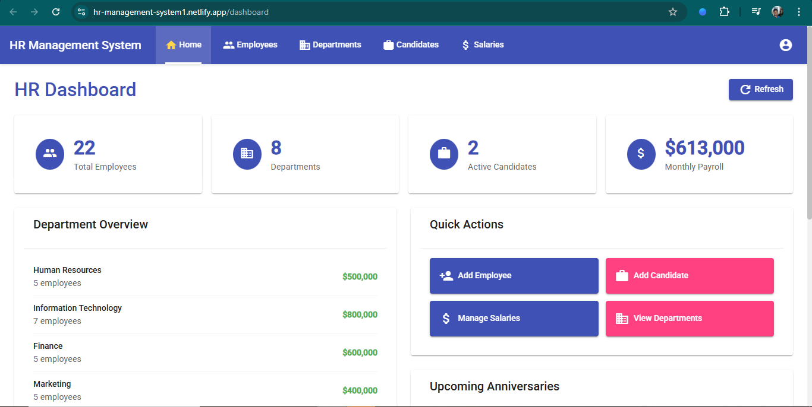
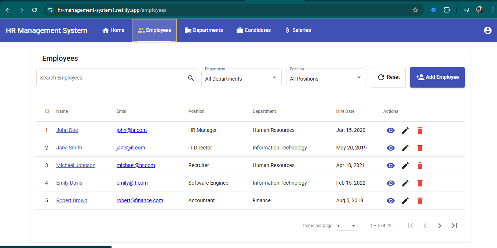
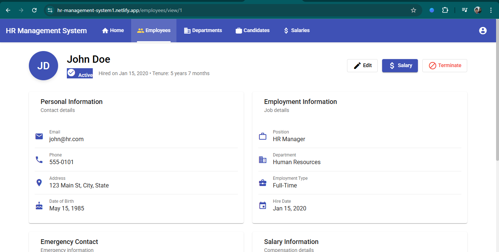
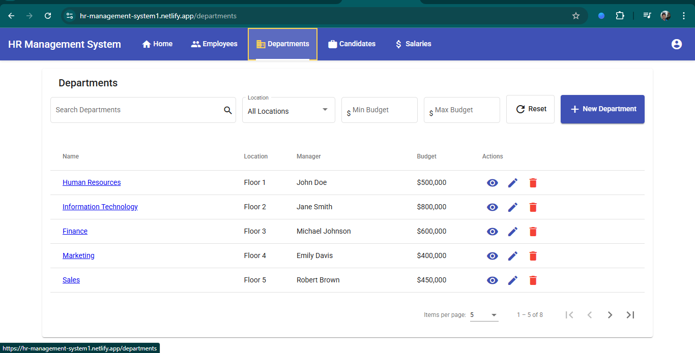
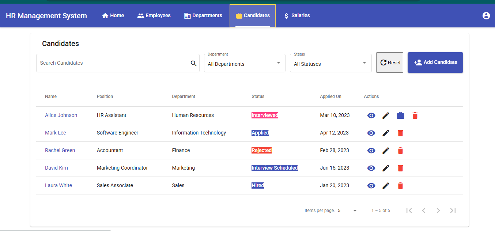
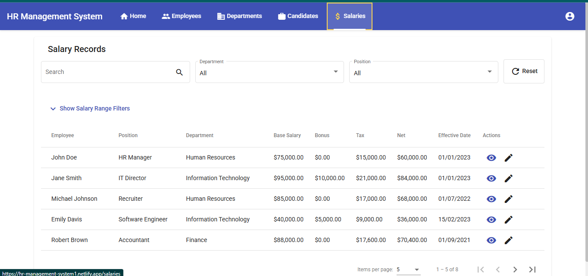

# HR Management System (Angular 8)


A simple HR Management System built with **Angular 8**, designed to manage employees, salaries, and other HR tasks.  
You can try it live here: [Demo Link](https://hr-management-system1.netlify.app/)


## 🚀 Features
- Employee Management (Add, Update, Delete employees)  
- Department Management(Full CRUD operations)
- Candidate Management (Full CRUD operations)
- Salary Management (track multiple salary records, update salaries without losing history)  
- Dashboard with employee & salary summary  
- Responsive UI using Angular Material  
- In-memory API for demo purposes  

---

## 📸 Screenshots
### Dashboard


### Employee List


### Add Employee


### Department List


### Candidate List


### Salary List



---

## 🛠️ Tech Stack
- **Frontend**: Angular 8, Angular Material  
- **Backend (Mock)**: Angular In-Memory Web API  
- **Deployment**: Netlify  

---

## 📂 Project Structure

```bash
src/
├── app/
│   ├── core/
│   │   └── services/          # Data services
│   ├── features/
│   │   ├── dashboard/         # Dashboard component
│   │   ├── employees/         # Employee management
│   │   ├── departments/       # Department management
│   │   ├── candidates/        # Candidate tracking
│   │   └── salaries/          # Salary management
│   ├── shared/
│   │   ├── components/        # Reusable components
│   │   ├── models/           # TypeScript interfaces
│   │   └── directives/       # Custom directives
│   └── app.module.ts         # Root module
└── assets/                   # Images and static files


---

## ⚙️ Setup & Installation
1. Clone the repository  
   ```bash
   git clone https://github.com/your-username/hr-management-system.git  
   cd hr-management-system
2. install dependencies
    npm install
3. Run Locally
    ng serve -o
4. build for production
    ng build --prod
---
## 🌐 Deployment

This project is deployed on **Netlify**.  

You can try it live here: [Demo Link](https://hr-management-system1.netlify.app/)

---

## 🙌 Author

Developed by **Your Name**.  
Feel free to connect with me on [LinkedIn](https://www.linkedin.com/in/hadush-brhane/)

